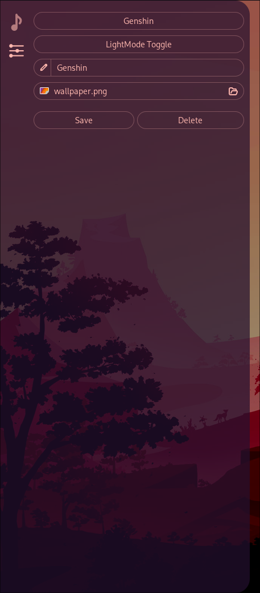

# What is this?

Frostlight is a Collection of AGS Widgets that might be useful for people.

I personally am developing them for my Hyprland setup, so features will be added as I need them

# Preview

### Media Control

### Theme Customization (WIP!)

# Requirements

Right now, for the **Customization** tab to work, you need:

- swww
- wallust (v3)
- magick

**This will change and those won't be required once customization is out of WIP**
Commands will be editable in a config later on so you can use whatever you want

# Installation

Install [AGS](https://aylur.github.io/ags-docs/config/installation/)

Clone the Repo

Put the files in `~/.config/ags`

Run `ags` (preferrably put the command in your autostart)

# Roadmap

Done:

- Config File
- Media Player
- Audio Stream Control
- Grouping of similiar Audio Streams (currently just when e.g. Games have multiple Streams)
- Collapseable Layout
- Audio Device Picker
- CSS Hot Reload
- Theme Customization
  - Different Themes
  - CSS Generation with Wallust

Still want to do:

- Show Audio children streams
- Taskbar at the top with Time, Calendar, Workspaces, App Icons, Bluetooth/Network Control
- Theme Customization
  - CSS Editor
  - Display Wallpaper in Tab
  - Commands customizeable in config
- Config (Extra Menu)
  - Adjust important variables
  - Change executed commands
- Application Picker (Extra Sub menu)
- System Ressources (Extra Sub Menu)
- Process Killer (in Sys Ressources)
- Couple QoL Changes
  - Hotkeys to show sidebar windows
  - Config for autogenerated themes
  - "Auto" mode for theme which checks system theme
