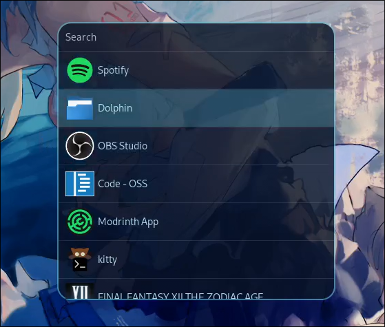

# What is this?

Frostlight is a Collection of AGS Widgets that might be useful for people.

I personally am developing them for my Hyprland setup, so features will be added as I need them

# Preview

### Media Control

### Theme Customization (WIP!)

### Config

### Topbar (WIP!)

### Applauncher

# Requirements

**If you use the default config, you will need:**

- swww
- wallust (v3)
- magick

**These are required for the customization tab. Each command can be changed in the `Config Window`**

# Installation

Install [AGS](https://aylur.github.io/ags-docs/config/installation/)

Clone the Repo

Put the files in `~/.config/ags`

Run `ags` (preferrably put the command in your autostart)

# Configuration

You can edit everything in the `Config Window`

The wallust config is located in `pathToYourAGS/style/wallust` if you want to edit how themes are generated

# Roadmap

| Feature                                | Status | Notes                                        |
| -------------------------------------- | ------ | -------------------------------------------- |
| Config File                            | ✔️     |                                              |
| Config Window                          | ✔️     |                                              |
| Media Player                           | ✔️     |                                              |
| Application Picker                     | ✔️     |                                              |
| Audio Application Control              | ✔️     |                                              |
| Audio Stream Grouping                  | ✔️     |                                              |
| Collapseable Layout                    | ✔️     |                                              |
| CSS Hot reload                         | ✔️     |                                              |
| Customization                          | ✔️🟡   | Works, but needs style update                |
| Wallust color generation               | ✔️     |                                              |
| Taskbar at Top                         | 🟡     | Not all Widgets done yet                     |
| Taskbar - Toggle                       | ✔️     | Allows to disable Taskbar                    |
| Taskbar - Time/Date                    | ✔️     |                                              |
| Taskbar - System Tray                  | ✔️     |                                              |
| Taskbar - Workspaces                   | ✔️     |                                              |
| Astal rewrite                          | ❌     | Idk when I should do this                    |
| Taskbar - Bluetooth                    | ❌     |                                              |
| Taskbar - Network Control              | ❌     |                                              |
| Taskbar - Calendar                     | ❌     |                                              |
| Taskbar - Keyboard Layout              | ❌     |                                              |
| CSS Editor                             | ❌     | Editor for color scheme                      |
| Show children of grouped Audio Streams | ❌     |                                              |
| Theme Picker Floating Window           | ❌     | Applauncher-like Window for Selecting Themes |
| System Ressource Window                | ❌     |                                              |
| Process Window                         | ❌     | Maybe part of System Ressources              |
| Calculator Window Floating Window      | ❌     | I really fucking need this myself            |
| Community YT Music Client controls via API Server      | ❌     |             |
