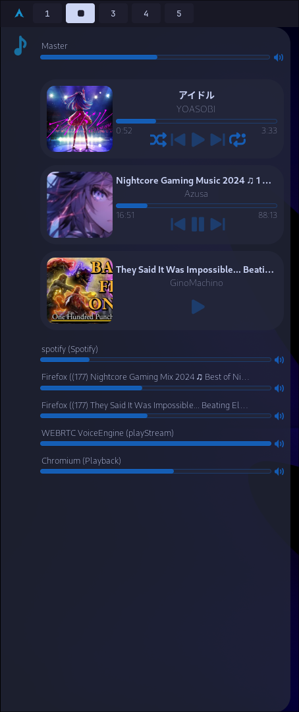

# What is this?

Frostlight is a Collection of AGS Widgets that might be useful for people.

I personally am developing them for my Hyprland setup, so features will be added as I need them

# Preview

# Installation

Install [AGS](https://aylur.github.io/ags-docs/config/installation/)

Clone the Repo

Put the files in `~/.config/ags`

Run `ags` (preferrably put the command in your autostart)

# Roadmap

Done:

- Media Player
- Audio Stream Control
- Grouping of similiar Audio Streams (currently just when e.g. Games have multiple Streams)
- Collapseable Layout

Still want to do:

- Config File
- Show Audio children streams
- Taskbar at the top with Time, Calendar, Workspaces, App Icons, Bluetooth/Network Control
- Theme Customization
