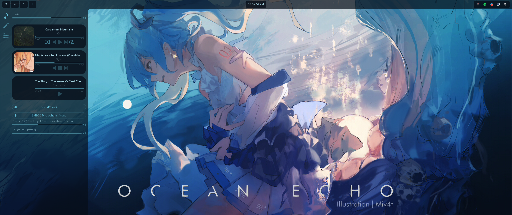

# What is this?

Frostlight is a Collection of AGS Widgets that might be useful for people.

I personally am developing them for my Hyprland setup, so features will be added as I need them

# Preview

### Media Control

### Theme Customization (WIP!)

### Config

### Topbar (WIP!)

### Applauncher

# Requirements

**If you use the default config, you will need:**

- swww
- wallust (v3)
- magick

**These are required for the customization tab. Each command can be changed in the `Config Window`**

# Installation

Install [AGS](https://aylur.github.io/ags-docs/config/installation/)

Clone the Repo

Put the files in `~/.config/ags`

Run `ags` (preferrably put the command in your autostart)

# Configuration

You can edit everything in the `Config Window`

The wallust config is located in `pathToYourAGS/style/wallust` if you want to edit how themes are generated

# Roadmap

### Done

- Config File
- Media Player
- Audio Stream Control
- Grouping of similiar Audio Streams (currently just when e.g. Games have multiple Streams)
- Collapseable Layout
- Audio Device Picker
- CSS Hot Reload
- Taskbar at the Top

  - Disableable in `config.json`
  - Time/Date
  - System Tray
  - Round Corner between side and topbar
  - Workspaces

- Theme Customization

  - Different Themes
  - CSS Generation with Wallust
  - Commands customizeable in config
  - Wallust/Image Manip configureable in config
  - Display Wallpaper in Tab

- Config (Extra Menu)

  - Adjust important variables
  - Change executed commands

### Still want to do

- Show Audio children streams
- Taskbar at the Top

  - Bluetooth Control
  - Network Control
  - Calendar
  - Keyboard Layout

- Theme Customization

  - CSS Editor
  - Make a better looking LightMode toggle...

- Application Picker (Extra Sub menu)
- System Ressources (Extra Sub Menu)
- Process Killer (in Sys Ressources)
- Couple QoL Changes

  - Hotkeys to show sidebar windows
  - Config for autogenerated themes
  - "Auto" mode for theme which checks system theme
